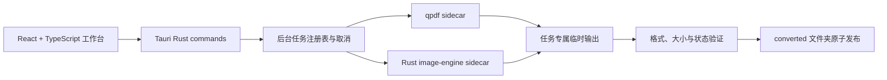
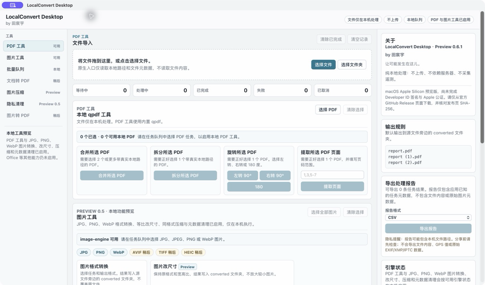
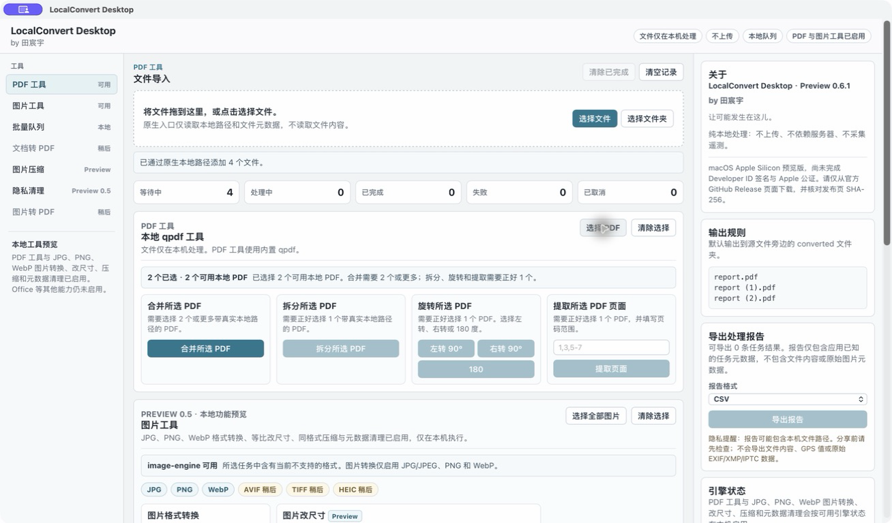
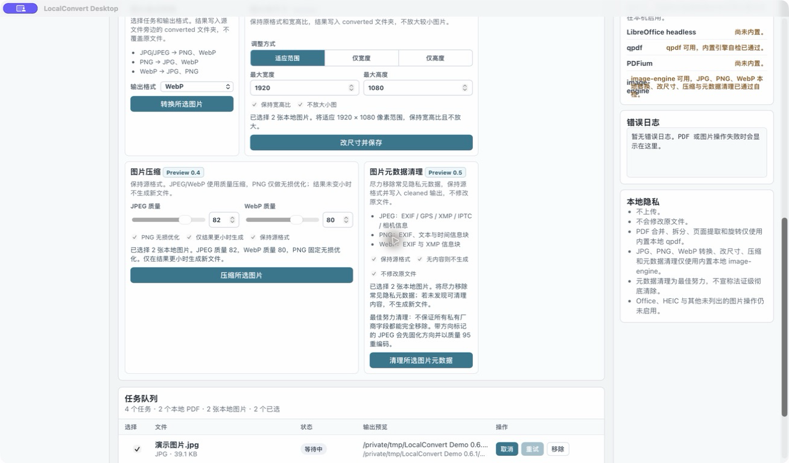
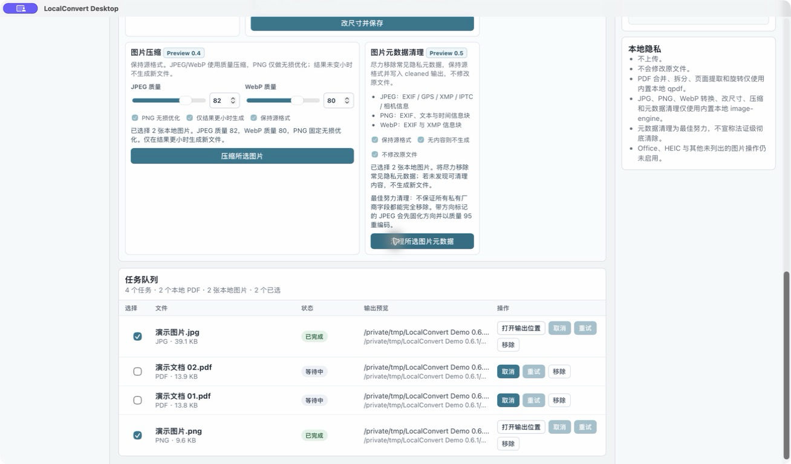
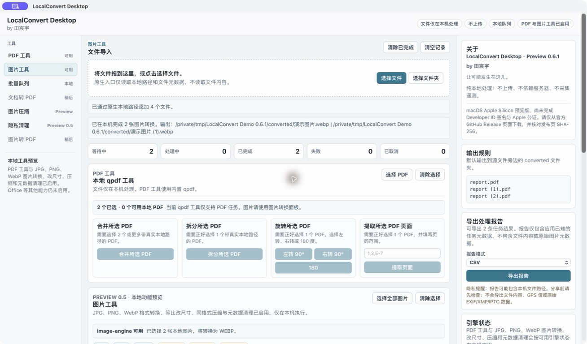
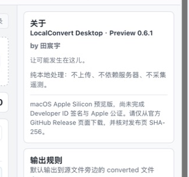

# LocalConvert Desktop 项目展示

**by 田宸宇**

> 让可能发生在这儿。

LocalConvert Desktop 是一款面向普通办公用户的纯本地桌面文件转换工具。它把 PDF 结构处理、JPG/PNG/WebP 图片转换与处理、批量任务状态和报告导出放在同一个克制的桌面工作台中；文件不上传，不依赖转换服务器，原文件默认不会被覆盖。当前稳定基线为 [Preview 0.6.1](https://github.com/1373878757-ux/localconvert-desktop/releases/tag/preview-0.6.1-task-usability-macos)，公开构建面向 macOS Apple Silicon，尚未完成 Developer ID 签名与 Apple 公证。

## Product Positioning

- **目标用户**：需要处理常见 PDF 和图片的办公用户、测试人员与重视本地隐私的个人用户。
- **核心场景**：批量导入文件，在一个本地队列中完成处理、查看结果、定位输出并导出报告。
- **交付方式**：安装包内置当前所需 sidecar，运行时用户不需要手动配置命令行引擎。
- **产品边界**：不做在线转换、账户、云存储、协作、视频或音频处理。

## Key Feature Highlights

| 能力 | 展示重点 |
| --- | --- |
| PDF 工具 | 合并、拆分、旋转和页面提取均由本地 qpdf 执行。 |
| 图片转换 | JPG/JPEG、PNG、WebP 之间的已启用方向。 |
| 图片改尺寸 | 适应范围、仅宽度、仅高度，保持宽高比且默认不放大。 |
| 图片压缩 | JPEG/WebP 质量压缩与 PNG 无损优化；未变小时不发布文件。 |
| 隐私清理 | 尽力移除常见图片元数据；无可清理内容时不发布文件。 |
| 批量任务 | 显示等待、处理、成功、失败和取消状态，支持真实后台取消。 |
| 安全输出 | 任务临时目录、结果验证、原子发布、重名递增和永不覆盖原文件。 |
| 结果交互 | 打开输出/报告位置、复制精简错误、二次确认清空界面记录。 |
| 报告导出 | CSV/JSON 记录任务结果，不包含文件内容或原始元数据载荷。 |

## Privacy-First Design

1. 源文件路径通过 Tauri 原生入口进入 Rust 后端，前端不读取文件内容。
2. 转换引擎随应用打包，受支持的操作不需要网络、账户或服务器。
3. sidecar 只通过参数数组启动，不拼接 shell 命令。
4. 引擎先写任务专属临时位置；验证输出非空后，才以无覆盖方式发布到源文件旁的 `converted` 文件夹。
5. 取消、失败和超时只清理任务自有临时文件，不删除源文件或任意最终路径。
6. 导出报告可能包含本地路径，但不包含文件字节或原始 EXIF/GPS/XMP/IPTC 载荷。
7. 元数据清理是最佳努力的隐私辅助功能，不宣传为法证级彻底清除。

## Technical Architecture

- **Tauri v2**：桌面窗口、原生文件入口、资源与 sidecar 打包。
- **React + TypeScript**：中文 UI、拖放、工具参数、任务状态与报告交互。
- **Rust backend**：路径校验、队列、进程管理、超时、取消、日志和输出发布。
- **qpdf**：PDF 合并、拆分、旋转和页面提取。
- **image-engine**：第一方 Rust sidecar，负责图片转换、改尺寸、压缩和元数据清理。
- **manifest verification**：在构建前检查资产、SHA-256、许可证和可执行权限。

## Release Milestones

| 版本 | 里程碑 |
| --- | --- |
| 0.1.x | qpdf PDF 工具与可靠本地执行基础 |
| 0.2.0 | JPG/PNG/WebP 图片格式转换 |
| 0.3.0 | 等比图片改尺寸 |
| 0.4.0 | JPEG/WebP/PNG 压缩与优化 |
| 0.5.0 | 图片元数据隐私清理 |
| 0.5.1 | macOS 安装与校验指引 |
| 0.6.0 | CSV/JSON 任务报告导出 |
| 0.6.1 | 输出导航、错误复制、历史清理确认与空状态优化 |

## Suggested Demo Flow

1. 启动应用，展示品牌启动屏和 qpdf/image-engine 本地自检。
2. 拖入两个小型 PDF，合并并打开输出位置。
3. 拖入 JPG 或 PNG，展示格式转换与改尺寸；快速带过压缩和元数据清理参数。
4. 展示成功、失败或取消状态，以及精简错误复制。
5. 导出 CSV 报告并打开报告位置。
6. 以“不上传、不会覆盖原文件、结果位于 converted 文件夹”收尾。

完整节奏见 [60 秒演示脚本](demo-script.md)。

## Product Screenshots

截图来自真实的 Preview 0.6.1 macOS 应用。演示任务只使用 `/private/tmp/LocalConvert Demo 0.6.1` 中生成的通用 PDF、渐变 JPG 和渐变 PNG，不含个人文件、用户名或真实隐私元数据。

### Empty Workspace

### PDF And Image Tools

| PDF tools | Image tools |
| --- | --- |
|  |  |

### Results And Reports

| Task results | Report export |
| --- | --- |
|  |  |

### About And Release Status

所有全窗口截图保持 1308 × 768；About 图仅机械裁切自同一真实窗口，未重绘或生成界面内容。后续替换截图时仍应使用安全合成文件并检查路径、文件内容和桌面背景。

## Portfolio-Ready Summary

### 中文

LocalConvert Desktop 是我使用 Tauri v2、React、TypeScript 和 Rust 构建的纯本地桌面文件转换工具。项目将 qpdf 与第一方 Rust 图片 sidecar 封装在安全的后台任务边界中，支持 PDF 合并/拆分/旋转/抽取页，以及 JPG/PNG/WebP 转换、改尺寸、压缩和元数据清理。实现重点不是格式数量，而是原生本地路径、真实取消、超时、自检、原子防覆盖输出、资产与许可证校验，以及不上传、不依赖服务器的隐私模型。

### English

LocalConvert Desktop is a local-only desktop file conversion utility built with Tauri v2, React, TypeScript, and Rust. It wraps qpdf and a first-party Rust image sidecar behind a validated background task boundary for PDF structure tools and JPG/PNG/WebP conversion, resizing, compression, and metadata cleanup. The project emphasizes native local paths, real cancellation, bounded engine checks, atomic no-overwrite output publication, packaged asset and license verification, and a privacy model with no uploads, server dependency, or telemetry.
